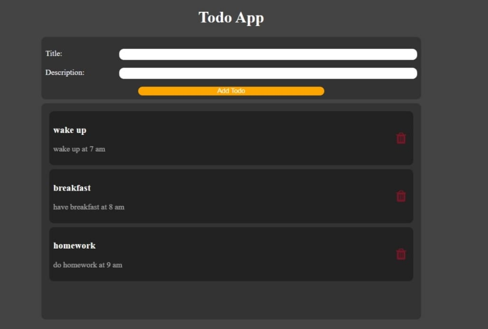

# React Todo App

A simple **Todo App** built using **React** and **Vite**. This app allows users to manage their daily tasks by adding and deleting todos.

## Features

- **Add Todo**: Add tasks with a title and description.
- **Delete Todo**: Remove tasks from the list once completed or no longer needed.
- **Responsive Design**: The app is responsive and works well on different screen sizes.

## Screenshots

## Tech Stack

- **Frontend**: React.js
- **Build Tool**: Vite
- **Styling**: CSS Modules
- **Icons**: Font Awesome (for delete icons)

